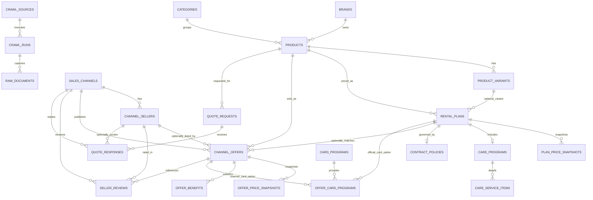

# Rental Offer Intelligence ERD

기준일: 2026-03-26

## 설계 목적

이 스키마는 단순 상품 카탈로그가 아니라 `렌탈 오퍼 비교`를 위한 구조입니다.

핵심 비교 단위는 `product`가 아니라 `channel_offer`입니다.

- `product`: 제품 자체
- `rental_plan`: 공급사 기준 플랜
- `channel_offer`: 특정 판매 채널/판매자가 실제로 노출하는 오퍼
- `offer_benefit`: 지원금, 사은품, 캐시백, 설치비 면제 같은 추가 혜택
- `quote_response`: 상담 후 확정 견적

즉, 같은 제품이라도 `공식 플랜 1개`에 `판매 채널 오퍼 여러 개`가 매핑될 수 있습니다.

## 핵심 관계

## 테이블 역할

### 공급사 기준 정보

- `brands`
- `categories`
- `products`
- `product_variants`
- `rental_plans`
- `plan_price_snapshots`
- `care_programs`
- `care_service_items`
- `contract_policies`

여기는 공급사 관점의 정답 테이블입니다.

### 판매 채널/오퍼 정보

- `sales_channels`
- `channel_sellers`
- `channel_offers`
- `offer_price_snapshots`
- `offer_benefits`
- `card_programs`
- `offer_card_programs`
- `seller_reviews`

여기가 실제 전환과 비교의 중심입니다.

### 견적형 데이터

- `quote_requests`
- `quote_responses`

공개 페이지에 없는 지원금은 결국 상담 데이터가 필요합니다.

### 수집 운영 데이터

- `crawl_sources`
- `crawl_runs`
- `raw_documents`

파이프라인 디버깅과 증적 보관용입니다.

## 비교 화면에서 주로 쓰는 조인 축

### 1. 제품 비교 목록

`products -> rental_plans -> channel_offers -> offer_benefits`

### 2. 판매처 비교

`channel_offers -> channel_sellers -> seller_reviews`

### 3. 카드 혜택 비교

`channel_offers -> offer_card_programs -> card_programs`

### 4. 계약 리스크 비교

`rental_plans -> contract_policies`

## 설계 포인트

### 1. `rental_plan`과 `channel_offer`를 분리

이 구조가 가장 중요합니다.

- `rental_plan`은 공급사 기준 조건
- `channel_offer`는 실제 판매 노출 조건

공급사 조건은 같아도 판매점 혜택이 달라지기 때문에 둘을 합치면 안 됩니다.

### 2. 혜택은 컬럼 하나로 묶지 않음

아래는 서로 성격이 다릅니다.

- 현금 지원
- 상품권
- 포인트
- 가전 사은품
- 첫 달 면제
- 설치비 면제

그래서 `offer_benefits`를 별도 테이블로 둡니다.

### 3. 지원금은 `정확값`만 있는 것이 아님

지원금 공개 방식은 아래처럼 나뉩니다.

- 정확 금액 공개
- 범위형 공개
- 숨김
- 상담 후 공개
- 후기로 추정 가능

그래서 `support_disclosure_status`와 `amount_min/max`가 필요합니다.

### 4. 실거래 검증을 위해 후기와 견적을 같이 보관

렌탈 시장은 공개 오퍼와 실거래가 다른 경우가 많습니다.

- `seller_reviews`: 후기 기반 검증
- `quote_responses`: 상담 기반 확정가

이 둘이 쌓이면 플랫폼별 신뢰도를 점수화할 수 있습니다.

## 1차 구현 범위

초기에는 아래 테이블만 먼저 구현해도 충분합니다.

- `brands`
- `categories`
- `products`
- `rental_plans`
- `plan_price_snapshots`
- `sales_channels`
- `channel_offers`
- `offer_price_snapshots`
- `offer_benefits`
- `contract_policies`
- `crawl_sources`
- `crawl_runs`
- `raw_documents`

그리고 아래는 2차로 올리면 됩니다.

- `channel_sellers`
- `seller_reviews`
- `quote_requests`
- `quote_responses`
- `offer_card_programs`
- `care_service_items`

## NestJS 모듈 제안

- `CatalogModule`: brands, categories, products, variants
- `PlanModule`: rental_plans, care_programs, contract_policies
- `OfferModule`: sales_channels, sellers, channel_offers, benefits
- `QuoteModule`: quote_requests, quote_responses
- `ReviewModule`: seller_reviews
- `CrawlerModule`: sources, runs, raw_documents
- `ComparisonModule`: 정렬/필터/체감가 계산

## 구현 메모

- 스냅샷 테이블은 append-only로 운영하는 것이 안전합니다.
- `channel_offer`에는 정규화된 비교용 컬럼과 원문 `jsonb`를 같이 두는 편이 좋습니다.
- `products.specifications`는 카테고리별 스펙 유연성을 위해 `jsonb`로 유지합니다.
- 체감가, 투명성 점수, 지급 신뢰 점수는 초기에 뷰나 애플리케이션 계산으로 두고, 나중에 materialized view로 올리는 것이 좋습니다.
