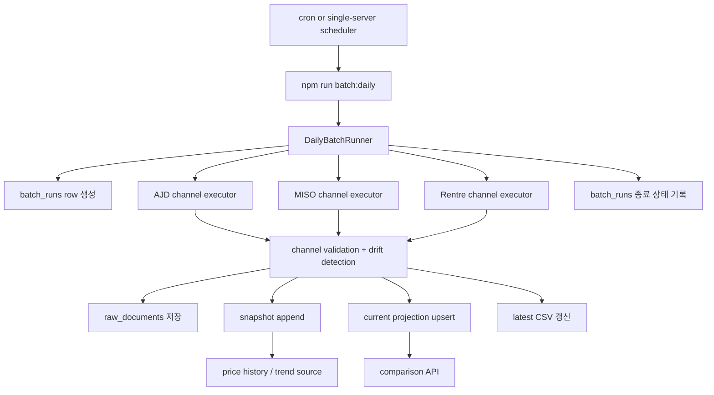

# Daily Batch Runner Design

기준일: 2026-03-28

## 목적

정수기 렌탈 가격 비교 데이터를 하루 1회 안정적으로 수집하고, 서비스는 최신 가격을 빠르게 조회하면서도 추후 가격 추세 분석이 가능한 배치 구조를 만든다.

이 설계는 MVP 기준으로 아래 목표를 만족한다.

- 외부 `cron` 또는 단일 서버 실행 환경에서 동일한 커맨드로 동작한다.
- 세 채널 중 일부가 실패해도 성공 채널의 최신 데이터는 반영한다.
- 현재 비교 조회는 빠르게 유지한다.
- 가격/카드사/약정 조건 변화는 이력으로 남긴다.
- 슬랙 알림은 나중에 포트 추가만으로 붙일 수 있게 설계한다.

## 배경

현재 프로젝트는 채널별 크롤러와 CSV export, 검증 스크립트까지는 갖추고 있다.

- 크롤링 엔트리포인트: `crawl:ajd`, `crawl:miso`, `crawl:rentre`, `crawl:all`
- 산출물: `latest-products.csv`, `latest-offers.csv`
- 검증: `crawl:validate`
- 기존 DB 스키마:
  - `crawl_sources`, `crawl_runs`, `raw_documents`
  - `products`, `rental_plans`, `channel_offers`
  - `plan_price_snapshots`, `offer_price_snapshots`

즉, 수집과 파일 출력은 이미 가능하고, 이번 설계의 범위는 이를 일일 배치 파이프라인과 DB 적재 구조로 감싸는 것이다.

## 범위

이번 설계에 포함한다.

- 일일 배치 엔트리포인트 설계
- 채널 단위 실패 격리
- DB 실행 이력 저장
- 최신 projection upsert 전략
- 가격 이력 저장 전략
- CSV 보존 정책
- drift/품질 검증 기준
- 테스트 전략

이번 설계에 포함하지 않는다.

- 슬랙/이메일 알림 실제 구현
- 실시간/시간당 배치
- 관리자 UI
- 가격 추세 조회 API 구현
- 세밀한 인프라 배포 자동화

## 대안 비교

### 1. Current-only Upsert

배치가 돌 때마다 현재 테이블만 갱신하고 과거는 남기지 않는다.

- 장점: 가장 단순하다.
- 단점: 가격 추세, 운영 재현, 장애 분석이 약하다.

이 프로젝트에는 부적합하다.

### 2. Snapshot + Current Projection

배치 실행마다 snapshot을 append-only로 저장하고, 서비스는 최신 projection만 조회한다.

- 장점: 현재 조회와 이력 보관의 균형이 좋다.
- 장점: MVP와 이후 확장 모두에 적합하다.
- 단점: current-only보다 구현 포인트가 조금 더 많다.

추천안이다.

### 3. 채널별 독립 스케줄 잡

각 채널을 완전히 별도 잡으로 운영한다.

- 장점: 실패 격리가 가장 강하다.
- 단점: MVP 기준으로 운영 복잡도가 높다.

장기적으로는 좋은 방향이지만 첫 배치 버전에는 과하다.

## 최종 선택

`단일 일일 배치 엔트리포인트 + 채널별 실행 단위 + snapshot/current 분리`를 채택한다.

외부에서는 하나의 커맨드만 실행한다.

- 예시: `npm run batch:daily`

내부에서는 채널별 실행 결과를 분리 저장한다.

- AJD 성공, 미소 성공, 렌트리 실패 같은 상태를 허용한다.
- 실패 채널은 기존 최신값을 유지한다.
- 성공 채널만 최신값을 갱신한다.

## 구조 개요



## 책임 분리

배치 코드는 현재 크롤러 파일에 직접 섞지 않고 별도 실행 계층으로 둔다.

권장 책임은 아래와 같다.

- `DailyBatchRunner`
  - 배치 실행 전체 오케스트레이션
  - 배치 실행 상태 집계
- `ChannelBatchExecutor`
  - 채널 하나 실행
  - 크롤링, 정규화, 검증, 적재 순서 관리
- `BatchRunRepository`
  - `batch_runs`, `crawl_runs` 기록
- `SnapshotWriter`
  - 이력 저장
- `CurrentProjectionUpdater`
  - 현재 조회용 normalized 테이블 upsert
- `BatchCsvManager`
  - latest CSV 갱신, incident archive 저장
- `DriftDetector`
  - count/null-rate/card-metadata 품질 경고 생성
- `BatchNotifier`
  - 현재는 noop
  - 추후 슬랙 notifier로 교체 가능

## DB 저장 전략

핵심 원칙은 아래 두 가지다.

- 이력은 append-only
- 현재 조회는 normalized current projection

### 1. 새로 추가할 테이블

#### `batch_runs`

일일 배치 실행 자체를 나타내는 최상위 실행 이력 테이블이다.

권장 컬럼:

- `id`
- `started_at`
- `finished_at`
- `status`
  - `running`
  - `success`
  - `partial_success`
  - `failed`
- `trigger_type`
  - `scheduled`
  - `manual`
- `channel_count`
- `success_channel_count`
- `failed_channel_count`
- `warning_count`
- `latest_products_csv_path`
- `latest_offers_csv_path`
- `archived_products_csv_path`
- `archived_offers_csv_path`
- `summary_json`

### 2. 기존 테이블 확장

#### `crawl_runs`

현재 스키마의 `crawl_runs`를 채널 실행 이력으로 재사용한다.

추가 권장 컬럼:

- `batch_run_id UUID NULL REFERENCES batch_runs(id)`
- `channel_slug TEXT`
- `items_failed INTEGER NOT NULL DEFAULT 0`
- `drift_status TEXT NOT NULL DEFAULT 'ok'`
  - `ok`
  - `warning`
  - `critical`

기존 `crawl_source_id`는 계속 유지한다. 즉, `batch_runs`가 상위 실행, `crawl_runs`가 채널별 하위 실행 역할을 맡는다.

### 3. 현재 projection 테이블

이 코드베이스에서는 별도 `current_offer/current_product` 테이블을 새로 만들기보다, 기존 normalized 테이블을 현재 projection으로 사용한다.

- `products`
- `rental_plans`
- `channel_offers`

이 테이블들은 최신 상태를 나타내고, 배치 성공 시 upsert 된다.

### 4. 이력 테이블

현재 가격 추세는 기존 snapshot 테이블을 사용한다.

- `plan_price_snapshots`
- `offer_price_snapshots`

MVP 범위에서는 별도 `product_snapshot` 테이블은 만들지 않는다.

이유:

- 가격 추세 요구는 주로 오퍼 가격 중심이다.
- 상품 스펙 이력은 우선순위가 낮다.
- 상품 메타데이터 원문은 `raw_documents`로 추적할 수 있다.

필요하면 2차에서 `product_snapshots`를 추가한다.

## 적재 원칙

### 원칙 1. 성공 채널만 current 갱신

예를 들어 렌트리가 실패하면 아래처럼 처리한다.

- AJD: snapshot 저장 + current upsert
- 미소: snapshot 저장 + current upsert
- 렌트리: 실패 기록만 저장, current 미갱신

이 경우 전체 `batch_runs.status`는 `partial_success`가 된다.

### 원칙 2. snapshot은 항상 실행 단위로 남김

성공 채널은 해당 실행 시점 가격을 이력으로 남긴다.

- 같은 오퍼라도 가격이나 카드사 정보가 바뀌면 새 snapshot이 쌓인다.
- 추세 조회는 snapshot 기준으로 구현한다.

### 원칙 3. raw 원문은 채널 단위 증적 보관

`raw_documents`는 디버깅과 재현을 위해 유지한다.

권장 저장 위치 예시:

- `var/crawl-runs/<yyyy-mm-dd>/<batch-run-id>/<channel>/...`

## 실행 흐름

일일 배치의 순서는 다음과 같다.

1. `batch_runs`에 `running` 상태 row 생성
2. 채널 목록 로드
3. 채널별로 `crawl_runs` row 생성
4. 크롤러 실행
5. raw 원문 저장
6. 정규화 결과 검증
7. drift 감지
8. 성공 채널은 snapshot 저장
9. 성공 채널은 current projection upsert
10. `latest-products.csv`, `latest-offers.csv` 갱신
11. 경고/실패가 있으면 timestamp archive 저장
12. `crawl_runs` 상태 종료
13. `batch_runs` 집계 종료

## 트랜잭션 경계

트랜잭션은 채널 단위로 묶는다.

- 배치 전체를 하나의 트랜잭션으로 묶지 않는다.
- 채널 하나의 normalized write는 가능하면 하나의 트랜잭션으로 처리한다.

즉, 채널 단위 write의 원자성은 보장하고, 배치 전체는 부분 성공을 허용한다.

## Drift와 품질 검증 기준

MVP에서는 과도한 복잡도 없이 아래 기준을 쓴다.

### Count drift

직전 `success` 또는 `partial_success` 실행과 비교한다.

- offer 수가 25% 이상 감소: `warning`
- offer 수가 50% 이상 감소: `critical`
- offer 수가 0: 채널 실패 처리

### Null-rate drift

아래 필드를 채널별로 본다.

- `contract_term_months`
- `management_type`
- `primary_card_company`

기준:

- null 비율이 직전 성공 실행보다 15%p 이상 악화: `warning`
- 절대 null 비율이 40% 이상이며 직전보다 악화: `critical`

### Card metadata drift

`has_affiliate_card = true`인 오퍼를 기준으로 본다.

- `primary_card_company` 또는 `primary_card_name` 채움률이 90% 미만이면 `warning`
- 70% 미만이면 `critical`

예외:

- 미소는 현재 공개 소스에서 카드사명이 노출되지 않으므로, 채널별 예외 정책으로 `informational`만 기록하고 실패 기준에는 넣지 않는다.

## CSV 정책

기본 정책은 `latest 유지 + incident archive 보존`이다.

항상 수행:

- `latest-products.csv`
- `latest-offers.csv`

추가 아카이브 저장 조건:

- 배치 상태가 `partial_success`
- 배치 상태가 `failed`
- any channel `drift_status != ok`

즉, 정상 배치에서는 timestamp archive를 남기지 않고, 장애/경고 증적이 있을 때만 남긴다.

## 스케줄링

스케줄링은 애플리케이션 내부가 아니라 외부에서 호출한다.

권장 이유:

- 단일 서버 cron과 임시 서버 운영 모두 호환된다.
- 추후 GitHub Actions, cloud scheduler로 옮겨도 엔트리포인트를 그대로 재사용할 수 있다.

권장 커맨드:

```bash
npm run batch:daily
```

권장 cron 예시:

```cron
0 5 * * * cd /path/to/rental_info_scrpper && /usr/bin/env npm run batch:daily >> /var/log/rental-info-batch.log 2>&1
```

## 로그와 알림

MVP에서는 아래를 기본으로 한다.

- 콘솔 로그
- DB 실행 이력

이 구조 위에 추후 notifier 포트를 붙인다.

```ts
interface BatchNotifier {
  notifyBatchCompleted(summary: BatchRunSummary): Promise<void>;
}
```

초기 구현은 noop notifier를 사용한다.

추후 슬랙 알림은 이 포트 구현체만 추가한다.

## 테스트 전략

### Unit Test

- 배치 상태 집계
- 채널 실패 시 overall status 계산
- drift detector
- CSV archive 저장 조건

### Integration Test

- 성공 채널 snapshot append
- 성공 채널 current projection upsert
- 실패 채널 current projection non-update
- `batch_runs`와 `crawl_runs` 관계 저장

### Batch Scenario Test

아래 시나리오는 반드시 커버한다.

- 세 채널 전부 성공
- 한 채널 실패, 두 채널 성공
- 한 채널 drift warning
- CSV latest는 항상 갱신, archive는 incident 때만 저장

## 단계적 구현 순서

1. `batch_runs` 테이블 추가
2. `crawl_runs`를 channel-run 개념으로 확장
3. 일일 배치 엔트리포인트 추가
4. 채널별 실행 결과를 DB에 기록
5. 성공 채널 current upsert 연결
6. snapshot append 연결
7. drift detector 연결
8. CSV incident archive 정책 추가
9. notifier 포트 추가

## 트레이드오프

이 설계는 MVP에서 약간 더 많은 테이블/상태를 다루지만, 아래 이점을 얻는다.

- 최신 비교 API는 빠르다.
- 과거 가격 추세를 잃지 않는다.
- 채널별 실패가 전체 서비스를 멈추지 않는다.
- 운영 중 문제가 생겨도 실행 이력과 원문 증적이 남는다.
- 슬랙 알림, 다회 배치, 채널 분리 스케줄로 확장하기 쉽다.

## 최종 결론

이 프로젝트의 일일 배치는 `외부 스케줄러가 호출하는 단일 엔트리포인트`로 시작하고, 내부적으로는 `채널별 실행 이력`, `append-only snapshot`, `current projection upsert`를 조합하는 것이 가장 적절하다.

현재 스키마를 최대한 활용하면서도 MVP 이후의 가격 추세와 운영 관측성 요구를 수용할 수 있는 현실적인 설계다.
